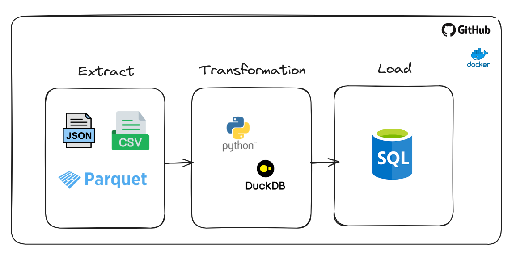

# ETL-in-Python-and-Duckdb2

### Processos e requisitos no desenvolvimento do ETL
1. Baixar arquivos do Gloogle Drive
2. Listar arquivos no dirtório 
3. Checar tipo do arquivo    
    3.1. CSV: Ler arquivo CSV  
    3.2. JSON: Ler arquivo JSON  
    3.3. Parquet: Ler arquivo Parquet  
4. Transformar em DataFrame  
5. Checar se o arquivo foi processado  
    5.1. Se sim, Fim do processamento do arquivo  
    5.2. Se não  
        - Salvar no PostgreSQL  
        - Registrar arquivo como processado  
        - Fim do processamento do arquivo  

---

### Descrição sobre libs utilizadas
- gdown: Biblioteca para fazer downloads de arquivos no Gloogle Drive, mas seu único problema é que ocorre algumas vezes erros de request ao fazer conexão com o Gloogle porque ele bloqueia algumas requisições. Para umma melhor perfomance e para um código de produção recomenda-se usar a própria API do Glogle